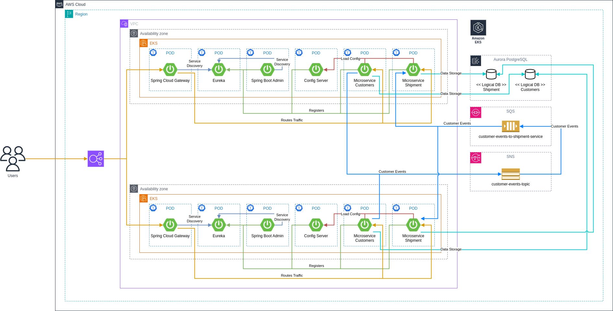

# AWS Spring Cloud Microservices - Event Driven Architecture (EDA) Sample

## Intro

This repository contains sample code showcasing Event-Driven Spring Cloud Microservices deployed to AWS.

## Concepts, Tools, Components

* Microservices
* Event Driven Architecture (EDA)
* Spring Boot
* Spring Cloud Stream
  * Spring Cloud Stream Binder for SNS
  * Spring Cloud Stream Binder for SQS
* Spring Cloud
  * Spring Cloud Eureka
  * Spring Cloud Config Server
  * Spring Cloud Gateway
  * Spring Boot Admin
* Infrastructure as a Code (IaaC) using Terraform
* Docker
* Docker Compose
* Testcontainers
* Localstack
* Kaniko Executor
* Java Memory Settings for Containers
* EKS
* ECR
* RDS Aurora PostgreSQL
* RDS IAM Authentication
* CI/CD Pipeline using Jenkins
  * Jenkins Operator
  * Jenkins Kubernetes Plugin
  * Jenkins Job DSL (Seed Jobs)
* JPA
* QueryDSL
* ModelMapper
* Liquibase
* Pre-Liquibase

## Architecture

## CI/CD

TBD

## Q&A on implementation choices

### Why Domain Driven Design (DDD) / Rich Domain Business Model was not used?

TBD

### Why single model instead of multiple domain, persistence and DTO model was used?

TBD

### Why Hexagonal Architecture was not used?

TBD

### Why packages are organized by technical concern?

TBD

### Why Spring Config was used instead of Kubernetes ConfigMaps?

TBD

### Why Eureka was used for Service Discovery instead of relying on Kubernetes Services or Istio Service Mesh?

TBD

## Author

Dominik Cebula

* https://dominikcebula.com/
* https://blog.dominikcebula.com/
* https://www.udemy.com/user/dominik-cebula/
