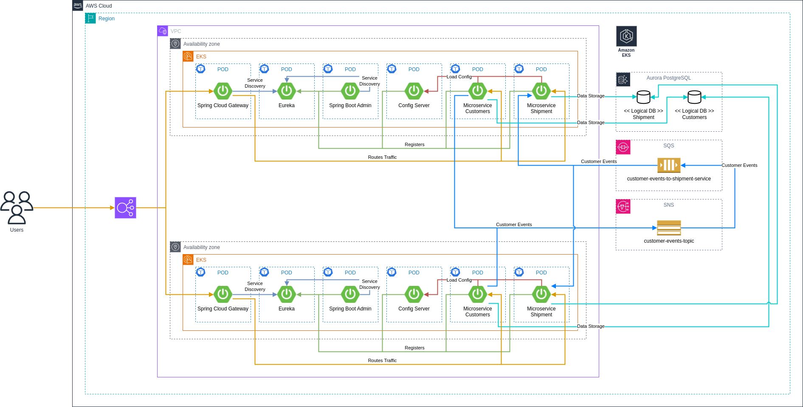

# AWS Spring Cloud Microservices - Event Driven Architecture (EDA) Sample

- [Overview](#Overview)
  - [Intro](#Intro)
  - [Concepts, Tools, Components](#concepts-tools-components)
  - [Architecture](#architecture)
  - [CI/CD](#cicd)
  - [Tests](#tests)
  - [Q&A on design choices](#qa-on-design-choices)
- [Usage](#usage)
  - [Building](#building)
  - [Running](#running)
  - [Executing Tests](#executing-tests)
  - [REST API Examples](#rest-api-examples)
- [Author](#author)

# Overview

## Intro

This repository contains sample code demonstrating Microservices implemented using an Event-Driven Architecture and
Spring Cloud Microservices.

The rationale behind the design choices is detailed in the
section [Q&A on design choices](#qa-on-design-choices).

The solution is deployable to AWS, with the following technologies utilized:

- Terraform for Infrastructure as Code (IaC).
- Amazon EKS for container orchestration.
- Amazon RDS Aurora PostgreSQL for data storage.
- CI/CD pipelines implemented using Jenkins, featuring auto-discoverable pipelines created through seed jobs.
- The Event-Driven Architecture (EDA) is built using Spring Cloud Streams, integrated with SNS Topics and SQS Queues.

The solution is locally executable using:

- Docker Compose
- Localstack Docker Image
- PostgreSQL Docker Image

Additional components include:

- API Gateway implemented with Spring Cloud Gateway.
- Distributed Configuration managed via Spring Cloud Config Server.
- Service Discovery enabled through Spring Cloud Eureka.

## Concepts, Tools, Components

* Microservices
* Event Driven Architecture (EDA)
* Spring Boot
* Spring Cloud Stream
  * Spring Cloud Stream Binder for SNS
  * Spring Cloud Stream Binder for SQS
* Spring Cloud
  * Spring Cloud Eureka
  * Spring Cloud Config Server
  * Spring Cloud Gateway
  * Spring Boot Admin
* Infrastructure as a Code (IaaC) using Terraform
* Docker
* Docker Compose
* Testcontainers
* Localstack
* Kaniko Executor
* Java Memory Settings for Containers
* EKS
* ECR
* RDS Aurora PostgreSQL
* RDS IAM Authentication
* CI/CD Pipeline using Jenkins
  * Jenkins Operator
  * Jenkins Kubernetes Plugin
  * Jenkins Job DSL (Seed Jobs)
* JPA
* QueryDSL
* ModelMapper
* Liquibase
* Pre-Liquibase

## Architecture



## CI/CD

TBD

## Tests

TBD

## Q&A on design choices

### Why Domain Driven Design (DDD) / Rich Domain Business Model was not used?

TBD

### Why single model instead of multiple domain, persistence and DTO model was used?

TBD

### Why Hexagonal Architecture was not used?

TBD

### Why packages are organized by technical concern?

TBD

### Why Spring Config was used instead of Kubernetes ConfigMaps?

TBD

### Why Eureka was used for Service Discovery instead of relying on Kubernetes Services or Istio Service Mesh?

TBD

# Usage

## Building

TBD

## Running

TBD

## Executing Tests

TBD

## REST API Examples

### Create Customers

```shell
curl -X POST -H "Content-Type: application/json" -d'{
    "firstName": "John",
    "lastName": "Doe",
    "email": "john.doe@example.com",
    "phone": "123-456-7890",
    "homeAddress": {
      "street": "123 Maple Street",
      "city": "Springfield",
      "state": "IL",
      "zipCode": "62704",
      "country": "USA"
    },
    "deliveryAddress": {
      "street": "456 Elm Avenue",
      "city": "Springfield",
      "state": "IL",
      "zipCode": "62711",
      "country": "USA"
    }
  }' http://localhost:8080/customers/api/v1/customers
  
curl -X POST -H "Content-Type: application/json" -d '{
    "firstName": "Jane",
    "lastName": "Smith",
    "email": "jane.smith@example.com",
    "phone": "987-654-3210",
    "homeAddress": {
      "street": "789 Pine Lane",
      "city": "Denver",
      "state": "CO",
      "zipCode": "80203",
      "country": "USA"
    },
    "deliveryAddress": {
      "street": "1010 Aspen Drive",
      "city": "Boulder",
      "state": "CO",
      "zipCode": "80301",
      "country": "USA"
    }
  }' http://localhost:8080/customers/api/v1/customers
  
curl -X POST -H "Content-Type: application/json" -d '{
    "firstName": "Emily",
    "lastName": "Johnson",
    "email": "emily.johnson@example.com",
    "phone": "555-123-4567",
    "homeAddress": {
      "street": "456 Oak Street",
      "city": "Seattle",
      "state": "WA",
      "zipCode": "98101",
      "country": "USA"
    },
    "deliveryAddress": {
      "street": "789 Birch Boulevard",
      "city": "Tacoma",
      "state": "WA",
      "zipCode": "98402",
      "country": "USA"
    }
  }' http://localhost:8080/customers/api/v1/customers


curl -X POST -H "Content-Type: application/json" -d '{
    "firstName": "Michael",
    "lastName": "Brown",
    "email": "michael.brown@example.com",
    "phone": "800-555-6789",
    "homeAddress": {
      "street": "222 Cherry Avenue",
      "city": "San Diego",
      "state": "CA",
      "zipCode": "92101",
      "country": "USA"
    },
    "deliveryAddress": {
      "street": "333 Redwood Way",
      "city": "Los Angeles",
      "state": "CA",
      "zipCode": "90001",
      "country": "USA"
    }
  }' http://localhost:8080/customers/api/v1/customers

curl -X POST -H "Content-Type: application/json" -d '{
    "firstName": "Sarah",
    "lastName": "Taylor",
    "email": "sarah.taylor@example.com",
    "phone": "900-321-7654",
    "homeAddress": {
      "street": "789 Walnut Road",
      "city": "Austin",
      "state": "TX",
      "zipCode": "78701",
      "country": "USA"
    },
    "deliveryAddress": {
      "street": "555 Cypress Avenue",
      "city": "Dallas",
      "state": "TX",
      "zipCode": "75201",
      "country": "USA"
    }
  }' http://localhost:8080/customers/api/v1/customers
```

### List all customers

```shell
curl -X GET -H "Content-Type: application/json" http://localhost:8080/customers/api/v1/customers
```

### Get Customer by ID

```shell
curl -X GET -H "Content-Type: application/json" http://localhost:8080/customers/api/v1/customers/1
```

### Search Customers

```shell
curl -X POST -H "Content-Type: application/json" -d '{
    "firstName": "Sarah",
    "lastName": "Taylor"
  }' http://localhost:8080/customers/api/v1/customers/search
```

### Update Customer

```shell
curl -X PUT -H "Content-Type: application/json" -d '{
    "firstName": "Emily",
    "lastName": "Clark",
    "email": "emily.clark@example.com",
    "phone": "987-654-3210",
    "homeAddress": {
      "street": "123 Pine Street",
      "city": "Denver",
      "state": "CO",
      "zipCode": "80203",
      "country": "USA"
    },
    "deliveryAddress": {
      "street": "456 Elm Avenue",
      "city": "Boulder",
      "state": "CO",
      "zipCode": "80301",
      "country": "USA"
    }
  }' http://localhost:8080/customers/api/v1/customers/1
```

### Delete Customer

```shell
curl -X DELETE http://localhost:8080/customers/api/v1/customers/1
```

### List all addresses

```shell
curl -X GET http://localhost:8080/shipment/api/v1//shipment/addresses
```

### Get address by ID

```shell
curl -X GET http://localhost:8080/shipment/api/v1/shipment/addresses/1
```

### Search for address

```shell
curl -X POST -H "Content-Type: application/json" -d '{
  "firstName": "Emily",
  "lastName": "Johnson"
}' http://localhost:8080/shipment/api/v1/shipment/addresses/search
```

# Author

Dominik Cebula

* https://dominikcebula.com/
* https://blog.dominikcebula.com/
* https://www.udemy.com/user/dominik-cebula/
